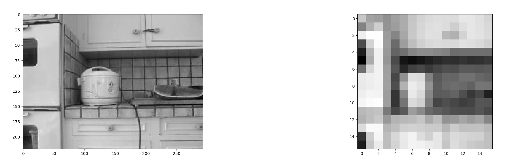
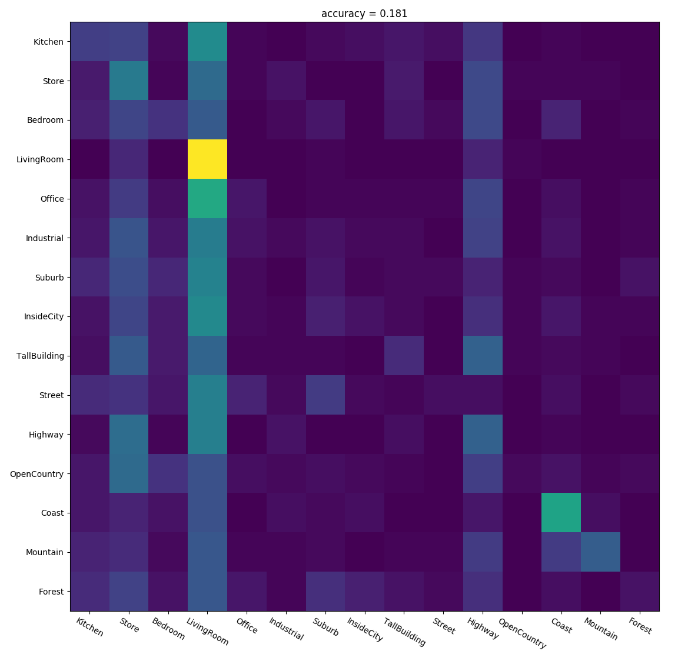
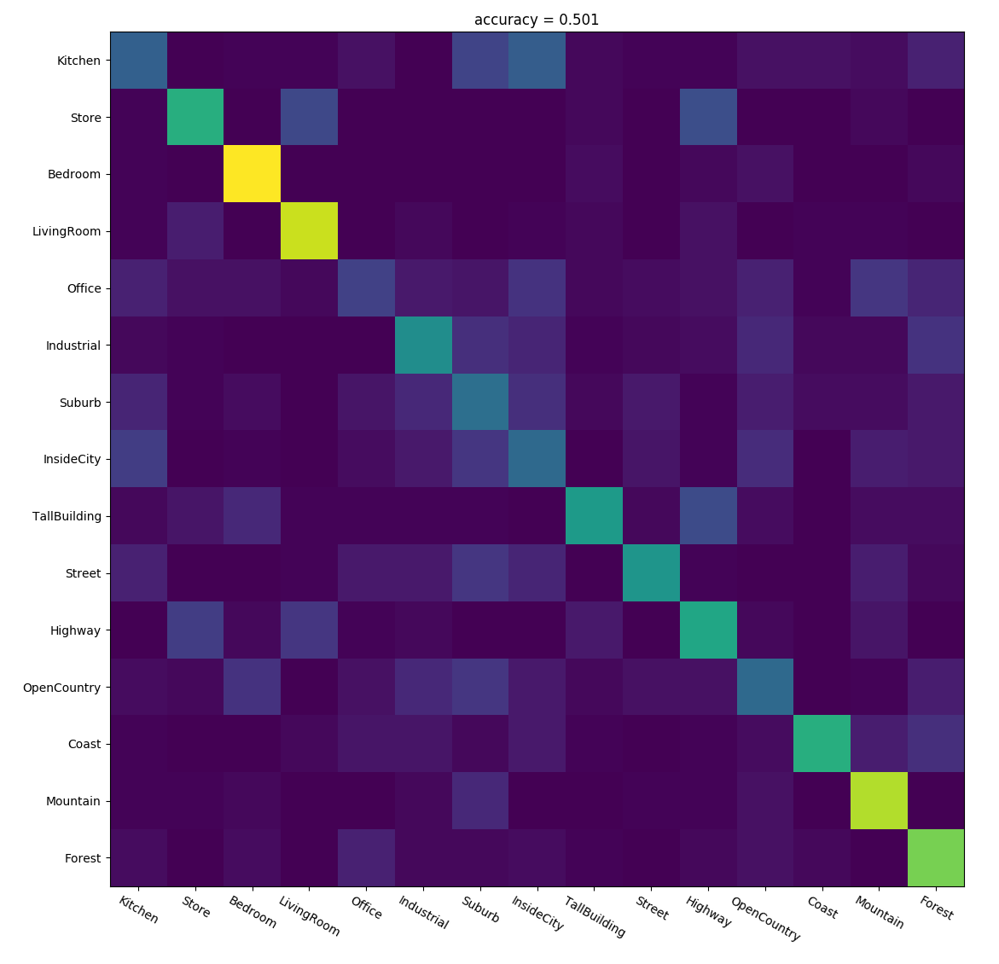
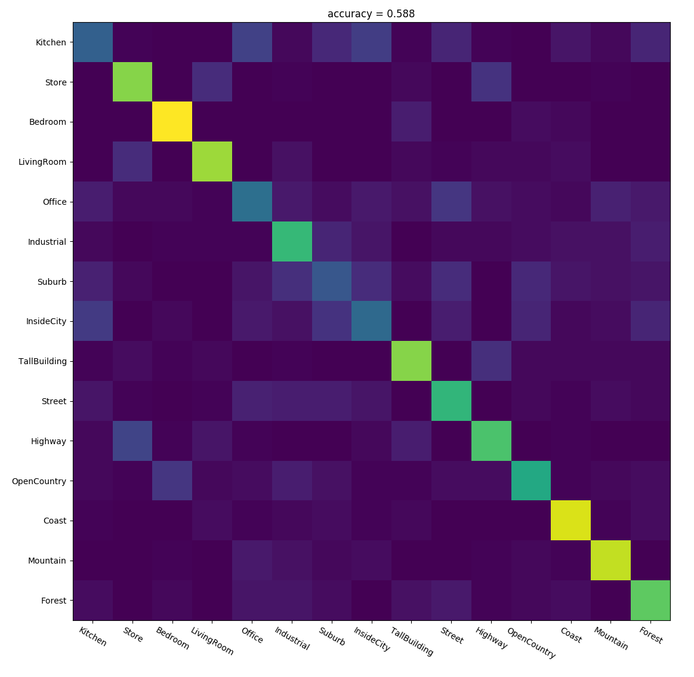

# image-recognition

## description
- A simple image classification task implementation.
- Descriptions used
    - tiny image (tiny).
    - bag of visual words (bow).
- Classifiers used
    - k nearest neighbour (knn).
    - support vector (svc).

## roadmap
Problems in `hw3.pdf` are solved.

## code
- All source code is in `scene_recognition.py`.
- Data (as zip file) is available [here](https://drive.google.com/file/d/19W2wTyEZm3LFg3ZZuegVtlEpifvarT70/view?usp=sharing).
- Unzip it at project root.
- Description of data format is given in `hw3.pdf`.

## documentation
- Code is the documentation of itself.

## usage
- Use `python3 scene_recognition.py` to classify images and visualize results using
    - `tiny + knn`.
    - `bow + knn`.
    - `bow + svc`.
- A summary of the methods and corresponding results is given in `report.pdf`.

## demonstration
- Tiny image description.

- `tiny + knn` confusion matrix.

- `bow + knn` confusion matrix.

- `bow + svc` confusion matrix.

