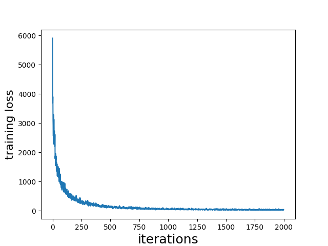
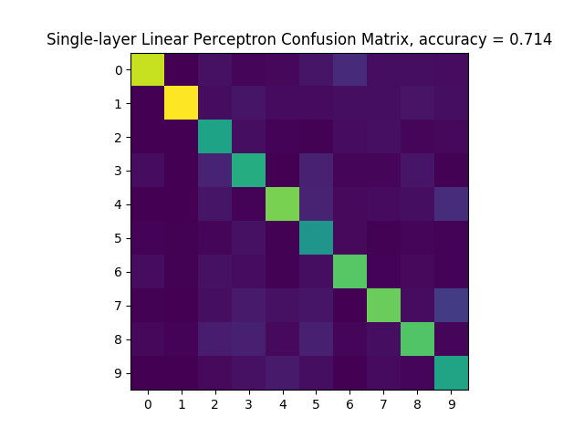
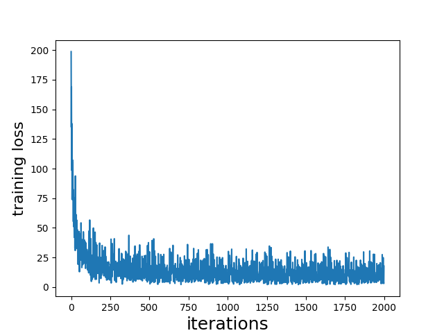
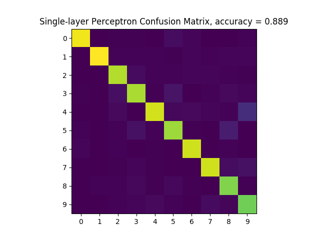
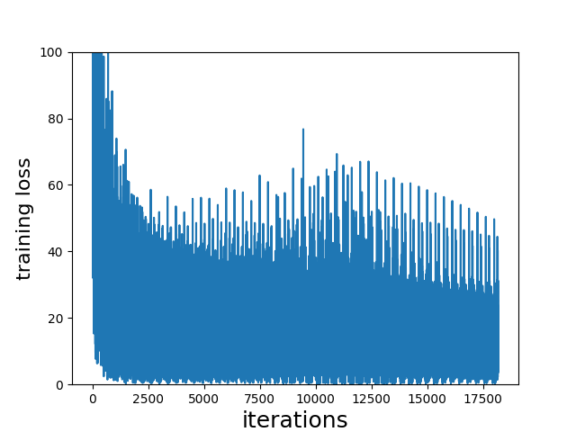
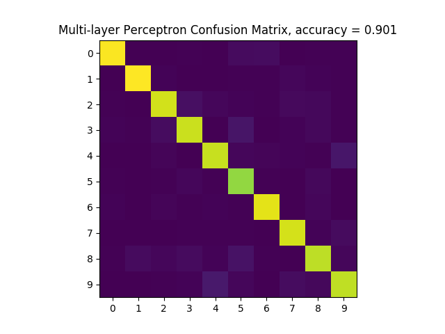
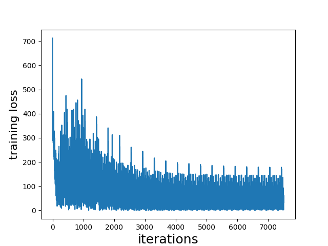
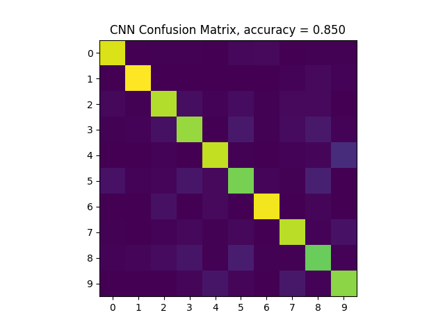

# deep-image-classification

## description
- A simple image classification implementation, where description and classification are done together.
- Models used
    - Linear single-layer perceptron.
    - Non-linear single-layer perceptron.
    - Multi-layer perceptron.
    - A pipeline with a convolutional layer.
- All models, forward and backward propogation steps are implemented from scratch.
- This is unlike a shallow classification, where description and classification are done separately.

## roadmap
Problems in `hw4.pdf` are solved.

## code
- All source code is in `cnn.py` & `main_functions.py`. Ironically `cnn.py` is the main file.
- `main_functions.py` reads `mnist_train.mat` & `mnist_test.mat`.
- Description of data format is given in `hw4.pdf`.
- `comps` contains results of models for different hyper parameters. It mainly serves as an example of how NOT to do a hyper parameter search :)

## documentation
- Code is the documentation of itself.

## usage
- Use `python3 cnn.py` to classify images and visualize results using above mentioned models.
- A summary of the methods and corresponding results is given in `report.pdf`.

## demonstration
- Linear single-layer perceptron.

- Non-linear single-layer perceptron.

- Multi-layer perceptron.

- A pipeline with a convolutional layer.

