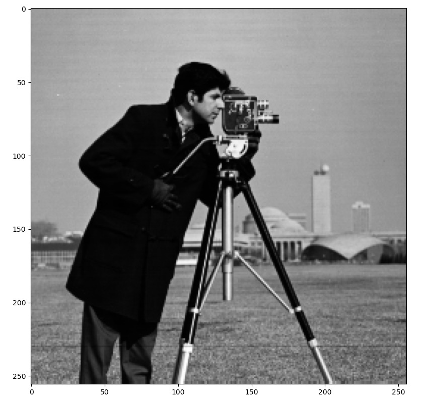
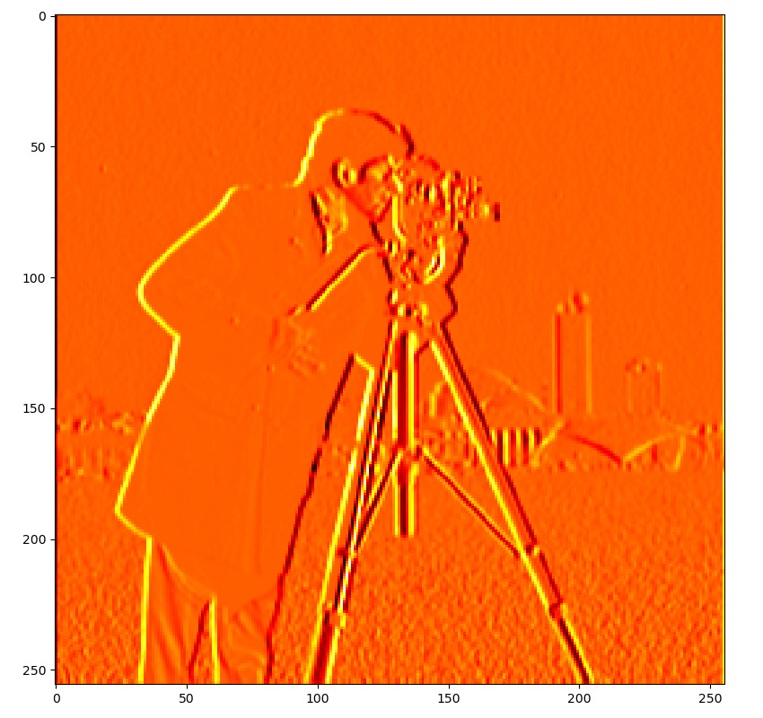
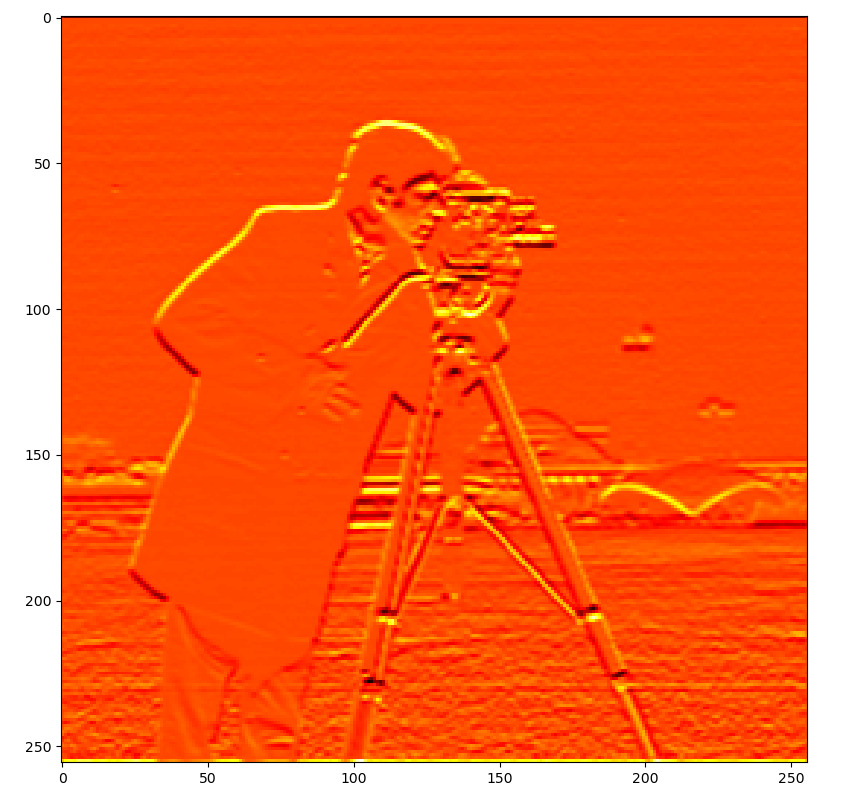
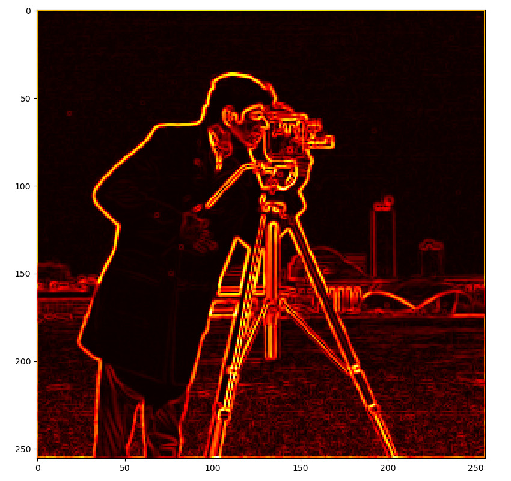
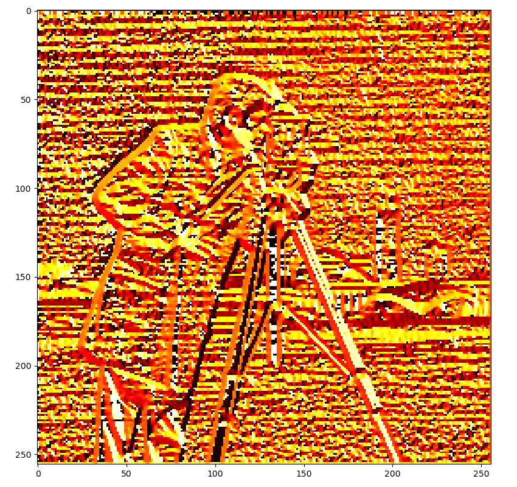

# image-description

## description
- A simple histogram-of-oriented-gradients-descriptor extractor.

## roadmap
- Problems in `hw1.pdf` are solved.

## code
- All source code is in `HOG.py`.
- It reads from `cameraman.tif`.

## documentation
- Code is the documentation of itself.

## usage
- `python3 HOG.py`.
- A summary of the pipeline is given in `summary.pdf`.

## demonstration
- The pipeline is illustrated below.

- Original image

- Output of horizontal-sobel filter (horizontal edges highlighted).

- Output of vertical-sobel filter (vertical edges highlighted).

- Magnitude of gradient.

- Direction of gradient.

- Histogram of oriented gradients.

